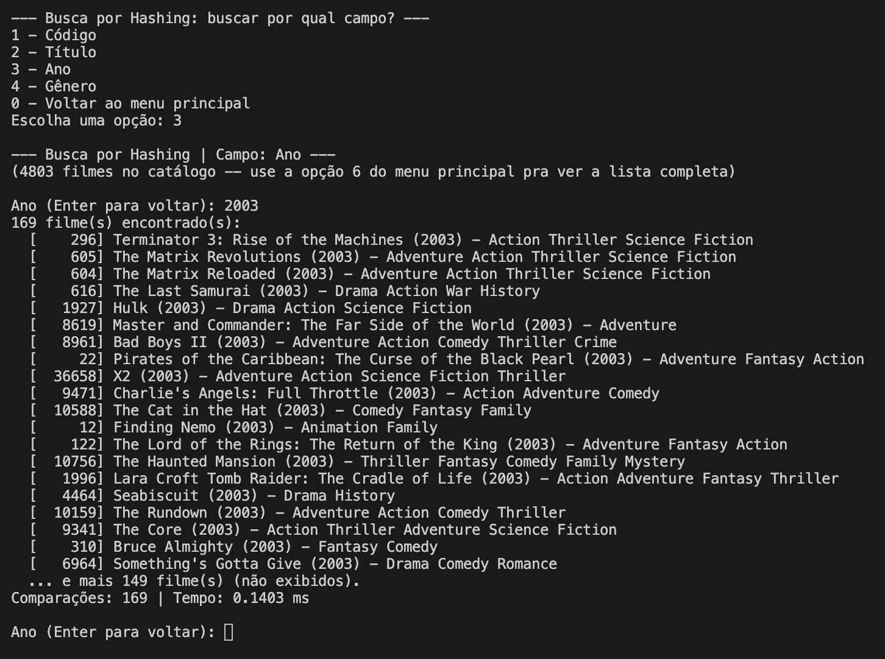
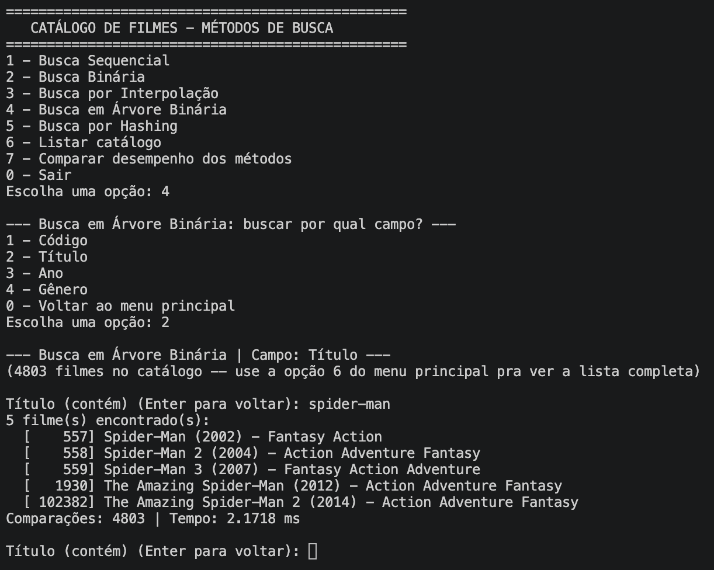
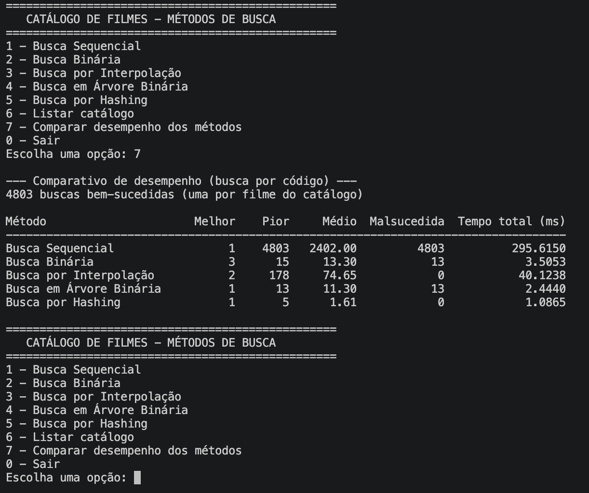

# G30_Busca_2026.2

Trabalho 1 
Conteúdo da Disciplina: algoritmo de busca 

## Alunos
|Matrícula | Aluno |
| -- | -- |
| 21/1063256  |  Victor Hugo Rodrigues Guimarães |
| 21/1063229  |  Pedro Henrique dos Santos Ferreira |

## Sobre 
Sistema de busca de filmes com o objetivo de encontrar por codigo, titulo, ano ou genero

## Screenshots

### Busca por ano (Hashing)

### Busca por titulo (Árvore Binária)

### Comparação de performance 

## Video 

## Instalação 
Linguagem: Python 

## Uso 
Execute o código da main.py